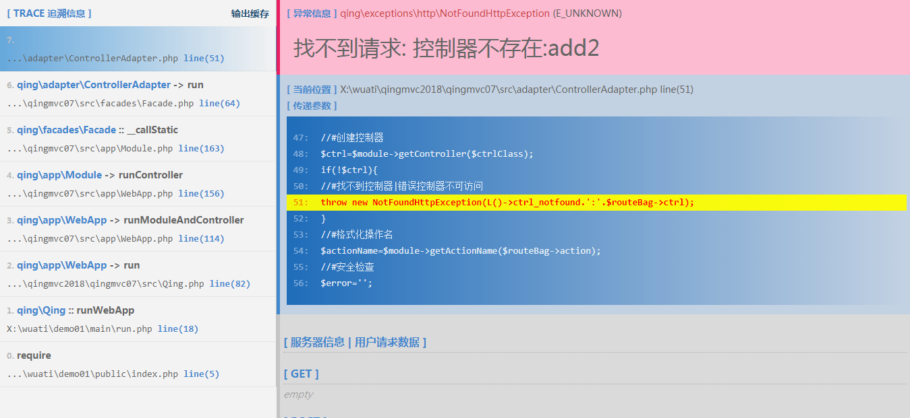

# 异常处理

# 错误报告设置

- APP_ERROR_LEVEL: 自定义错误报告等级。
- APP_DEBUG: 是否显示错误报告
	- true: 显示错误报告信息
	- false: 关闭在窗口显示错误显示，会保存到服务器软件日志。

```
define('APP_DEBUG'			,true);
define('APP_ERROR_LEVEL'	,E_ALL ^E_NOTICE);

if(defined('APP_ERROR_LEVEL')){
	//自定义报告等级:define('APP_ERROR_LEVEL',E_ALL ^ E_NOTICE);
	error_reporting(APP_ERROR_LEVEL);
}else{
	error_reporting(E_ALL ^ E_NOTICE);
}
//错误报告等级，后面的设置会覆盖前面的设置
if($debug){
	//直接在窗口显示错误显示
	@ini_set("display_errors","On");
}else{
	//保存到服务器日志的错误等级
	//error_reporting(E_ALL ^ E_NOTICE);
	//关闭在窗口显示错误显示
	@ini_set("display_errors","Off");
}
```

# 异常处理

- 异常处理器组件: `\qing\exception\ExceptionHandler`。
- APP_DEBUG和组件$debug联合确认处理模式。
- 异常处理有两种模式：**调试模式和生产模式**。

```
\qing\exception\ExceptionHandler
/**
 * 调试异常信息
 * - 和APP_DEBUG联合确认是否显示调试信息
 *
 * @var string
 */
public $debug=false;
```

## 调试模式/DEBUG模式/开发模式

- 开启方式: APP_DEBUG=true并且$debug=true。
- 显示详细的异常信息，异常抛出点的追溯信息，服务器环境信息等。
- 一般只在本地开发环境开启，生产环境不要开启调试模式，有安全风险。

### local.php/本地环境配置

```
define('APP_DEBUG',true);

//异常处理器
'exception'=>
[
	'debug'=>true
],
```


## 生产模式/线上模式

- 开启方式: APP_DEBUG=false或者$debug=false。
- 只发送异常码响应头，和安全的简单提示信息，不能会显示敏感信息。比如404响应，“请求不存在”等。


### main.php/主环境配置

```
define('APP_DEBUG',false);

//异常处理器
'exception'=>
[
	'debug'=>false
],
```


# 第三方异常处理器组件

- 暂未实现
- whoops

# 异常的异常：异常处理器内抛出异常

- 异常处理器不能抛出异常，抛出的会被捕获简单处理，避免线上环境暴露敏感信息。
- 异常处理器内部异常，主要有：应用未初始化。。。
